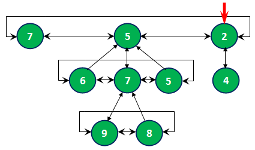

# Fibonacci heap

[](https://github.com/Algorithms-and-Data-Structures-2021/semester-work-fibonacci-heap/actions/workflows/cmake.yml)

_Краткое описание семестрового проекта:_


- _Фибоначчиева куча (англ. Fibonacci heap) — структура данных, отвечающая интерфейсу priority queue.
  Имеет меньшую амортизированную сложность, чем такие приоритетные очереди как биномиальная куча и двоичная куча._


- _Фибоначчиева куча представляет собой набор фибоначчиевых деревьев_

  (прим. Фибоначчиево дерево – это k-ичное дерево, для каждого элемента которого выполняется правило:
  «дочерний элемент не превышает своего родителя». Корни фибоначчиевых деревьев хранятся в виде кольцевого списка.
  Каждый узел фибоначчиева дерева, помимо указателей на левого, правого брата, на родителя и на одного из своих
  сыновей содержит информацию о количестве дочерних узлов.)

**Пример:**




- _Фибоначчиевыкучи нашли широкое применение в алгоритмах на графах(поиск минимального остовногодерева, поиск кратчайшего пути в графе)_

- _Основные операции:_

  - Поиск минимального элемента (_getMinimum_)
  - Добавление нового элемента (_insert_)
  - Объединение двух фибоначчиевых куч (_merge_)
  - Удаление минимального элемента (_removeMinimum_)
  - Изменение элемента (_decreaseKey_)

## _Теоритическая сложность операций_
| Операция    | 	Амортизированная сложность|
  | :---                 |   ---:    |  
| insert       | O(1)    | 
| getMinimum  | O(1)       |
| merge        | O(1)    | 
| removeMunimum  | O(log n)       |
| decreaseKey  | O(1)       |


## Команда "Fibonacci team"

| Фамилия Имя          | Вклад (%) | Прозвище              |
| :---                 |   ---:    |  ---:                 |
| Ибаев Даниль         | 50        |  _    _               |
| Анастасия Войтенко   | 50        |  _                  _ |

**Девиз команды**
> _Наши цели ясны. Задачи определены. За работу, товарищи!_

## Структура проекта

_Описание основных частей семестрового проекта._

_Проект состоит из следующих частей:_

- [`src`](src)/[`include`](include) - реализация структуры данных (исходный код и заголовочные файлы);
- [`benchmark`](benchmark) - контрольные тесты производительности структуры данных (операции добавления, удаления,
  поиска и пр.);
- [`examples`](examples) - примеры работы со структурой данных;
- [`dataset`](dataset) - наборы данных для запуска контрольных тестов и их генерация;

## Требования (Prerequisites)

_В этом разделе задаются основые требования к программному и аппаратному обеспечению для успешной работы с проектом._

_Рекомендуемые требования:_

1. С++ компилятор c поддержкой стандарта C++17 (например, _GNU GCC 8.1.x_ и выше).
2. Система автоматизации сборки _CMake_ (версия _3.12.x_ и выше).
3. Интерпретатор _Python_ (версия _3.7.x_ и выше).
4. Рекомендуемый объем оперативной памяти - не менее 4 ГБ.
5. Свободное дисковое пространство объемом ~ 3 ГБ (набор данных для контрольных тестов).

## Сборка и запуск

_Инструкция по сборке проекта, генерации тестовых данных, запуска контрольных тестов и примеров работы._

### Пример (Windows)

#### Сборка проекта

_Опишите процесс сборки проекта._

Склонируйте проект к себе на устройство через [Git for Windows](https://gitforwindows.org/) (либо используйте
возможности IDE):

```shell
git clone https://github.com/Algorithms-and-Data-Structures-2021/semester-work-fibonacci-heap.git
```

#### Генерация тестовых данных


Генерация тестового набора данных в
формате [comma-seperated values (CSV)](https://en.wikipedia.org/wiki/Comma-separated_values):

```shell
# Входные данные для тестов находятся в папке 
cd dataset/data
```

Тестовые данные представлены в CSV формате (см.
[\dataset\data\insert\01\100.csv](dataset/data/insert/01/100.csv)):

```csv
39
80
21
...
```

По названию директории `/dataset/data/insert` можно понять, что здесь хранятся наборы данных для контрольных тестов по
**добавлению** элементов в структуру данных. Названия файлов `100.csv`. `5000000.csv` и т.д. хранят информацию о размере набора данных (т.е. количество элементов).

#### Контрольные тесты (benchmarks)


##### Список контрольных тестов

| Название                  | Описание                                | Метрики         |
| :---                      | ---                                     | :---            |
| `benchmark_merge` | объединение двух куч   | _время_         |
| `benchmark_insert`| добавление элементов в структуру данных | _время_ |
| `benchmark_remove`| удаление минимального элемента| _время_|

##### Примеры запуска

```shell
#Перейдите в папку с контрольными тестами
cd benchmark 
#В папке есть 3 файла с контрольными тестами
benchmark_insert.cpp
benchmark_merge.cpp
benchmark_remove.cpp
#Перейдите в один из файлов и запустите метод
main()
# После прогона контрольных тестов в папке benchmark/result появятся 3 файла с результатами тестов
benchmark_insert_result.csv
benchmark_merge_result.csv
benchmark_remove_result.csv
```
В файлы записываются 4 числа через запятую:

1)_номер папки входных данных_

2)_количество входных данных_

3)_номер прогона_

4)_время(в нс)_
## Источники

_Список использованных при реализации структуры данных источников:_

- _Статья "Приоритетная очередь на основе бинарной, биномиальной и фибонначиевой куч" :_ https://www.rsdn.org/article/submit/heap/heaps.xml#ERFAE
-  _Статья "Фибоначчиева куча" Университет ИТМО_
- https://ru.wikipedia.org "Фибоначчиева куча"
- Лучшая лекция от ИТМО: https://www.youtube.com/watch?v=IXcdJuRbqPU&t=3530s
